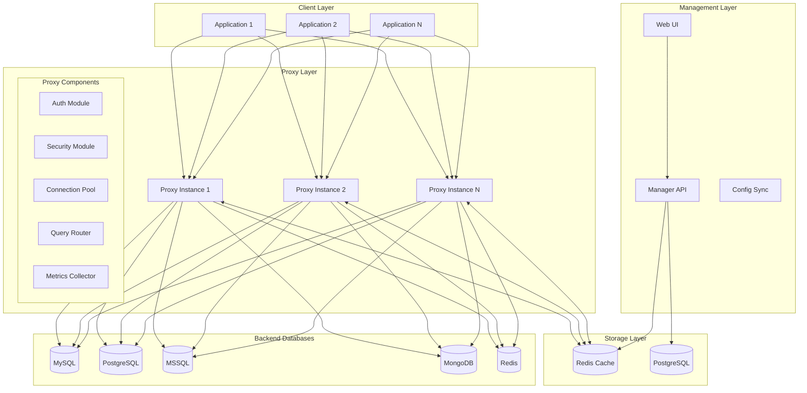
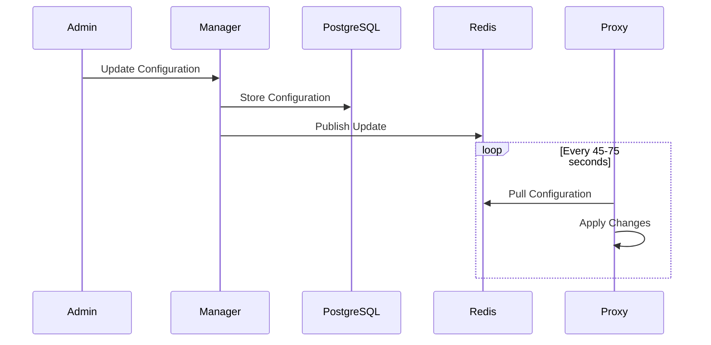
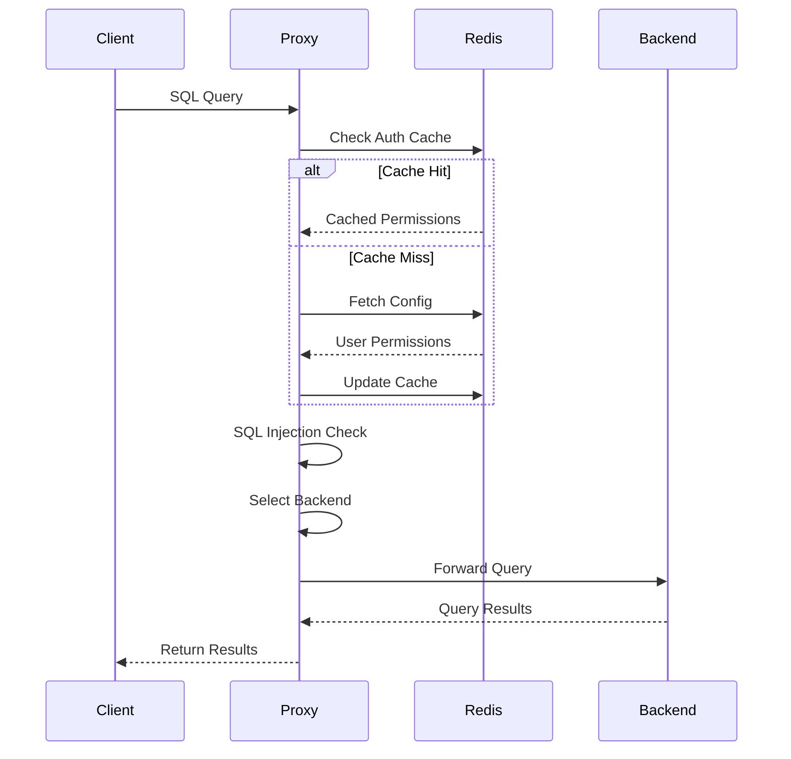

# 🏗️ ArticDBM Architecture

## Overview

ArticDBM v1.2.0 features a revolutionary **XDP-accelerated microservices architecture** that delivers extreme performance through kernel-level packet processing while maintaining the secure, scalable database access management of previous versions. The architecture combines traditional microservices patterns with cutting-edge eBPF/XDP technology for unprecedented throughput.

## 🎯 Design Principles

1. **Extreme Performance**: XDP/AF_XDP kernel acceleration for 100M+ packets/second
2. **NUMA Optimization**: Memory locality awareness for multi-socket systems
3. **Security by Default**: eBPF-based filtering with real-time threat intelligence
4. **Zero-Copy Networking**: AF_XDP sockets minimize CPU overhead
5. **High Availability**: Cluster mode with XDP-enabled load balancing
6. **Cloud Native**: Kubernetes operator with XDP support
7. **Database Agnostic**: Protocol translation with kernel-level optimization

## 🔧 System Components



## 📦 Component Details

### ArticDBM Proxy

The proxy is the core component handling database traffic.

#### Key Features
- **Protocol Translation**: Native support for multiple database protocols
- **Connection Pooling**: Efficient connection management per backend
- **Query Routing**: Intelligent read/write splitting
- **Security Enforcement**: Real-time SQL injection detection
- **Metrics Collection**: Prometheus-compatible metrics

#### Internal Architecture

```go
type Proxy struct {
    Config        *Config
    AuthManager   *AuthManager
    SecurityCheck *SecurityChecker
    Pools         map[string]*ConnectionPool
    Router        *QueryRouter
    Metrics       *MetricsCollector
}
```

#### Request Flow

1. **Connection Accept**: TCP listener accepts client connection
2. **Protocol Handshake**: Database-specific handshake
3. **Authentication**: Validate user credentials
4. **Authorization**: Check permissions for database/table
5. **Security Check**: SQL injection detection
6. **Query Routing**: Select appropriate backend
7. **Query Execution**: Forward to backend database
8. **Response Processing**: Return results to client

### ArticDBM Manager

The manager provides configuration and monitoring capabilities.

#### Components
- **API Server**: RESTful API for configuration and database management
- **Web UI**: py4web-based management interface with database CRUD operations
- **Config Sync**: Redis-based configuration distribution
- **Audit Logger**: Query and access logging
- **Database Manager**: Lifecycle management for databases
- **SQL File Processor**: Secure upload, validation, and execution of SQL files
- **Security Validator**: Comprehensive SQL content security analysis
- **Blocking Engine**: Default and custom resource blocking system

#### Data Models

```python
# User Model
class User:
    username: str
    password_hash: str
    enabled: bool
    created_at: datetime
    
# Permission Model
class Permission:
    user_id: str
    database: str
    table: str
    actions: List[str]  # ['read', 'write']
    
# Backend Model
class Backend:
    host: str
    port: int
    type: str  # 'read' or 'write'
    weight: int
    tls_enabled: bool

# Managed Database Model
class ManagedDatabase:
    name: str
    server_id: int
    database_name: str
    description: str
    schema_version: str
    auto_backup: bool
    backup_schedule: str
    active: bool
    
# SQL File Model
class SQLFile:
    name: str
    database_id: int
    file_type: str  # 'init', 'backup', 'migration', 'patch'
    file_path: str
    file_size: int
    checksum: str
    syntax_validated: bool
    security_validated: bool
    validation_errors: str
    executed: bool
    executed_at: datetime
    executed_by: int

# Blocked Resource Model
class BlockedDatabase:
    name: str
    type: str  # 'database', 'username', 'table'
    pattern: str
    reason: str
    active: bool

# Database Schema Model
class DatabaseSchema:
    database_id: int
    table_name: str
    column_name: str
    data_type: str
    is_nullable: bool
    default_value: str
    is_primary_key: bool
    is_foreign_key: bool
    foreign_table: str
    foreign_column: str
```

## 🔄 Data Flow

### Configuration Updates



### Query Processing



## 🚀 Performance Optimizations

### Connection Pooling

- Pre-established connections to backends
- Configurable pool size per backend
- Connection health checking
- Automatic reconnection on failure

### Caching Strategy

```yaml
Cache Layers:
  L1 - In-Memory:
    - User permissions (5 min TTL)
    - Backend configurations (1 min TTL)
  L2 - Redis:
    - Full configuration (5 min TTL)
    - Authentication tokens (15 min TTL)
```

### Load Balancing

```go
// Round-robin with weights
func SelectBackend(backends []Backend) *Backend {
    totalWeight := 0
    for _, b := range backends {
        totalWeight += b.Weight
    }
    
    random := rand.Intn(totalWeight)
    for _, b := range backends {
        random -= b.Weight
        if random < 0 {
            return &b
        }
    }
    return &backends[0]
}
```

## 🔒 Security Architecture

### Defense in Depth

1. **Network Level**: TLS encryption for all connections
2. **Authentication**: User credential validation
3. **Authorization**: Fine-grained permission checks
4. **Query Analysis**: SQL injection pattern detection
5. **Audit Logging**: Complete query audit trail

### Enhanced Security Detection System

ArticDBM implements a comprehensive, multi-layered security detection system with 40+ attack patterns:

#### SQL Injection Detection

```go
type SecurityChecker struct {
    patterns []*regexp.Regexp
    redis    *redis.Client
    enabled  bool
}

// Core SQL injection patterns
patterns := []string{
    // Classic injection patterns
    `(?i)(\bunion\b.*\bselect\b|\bselect\b.*\bunion\b)`,
    `(?i)(;\s*drop\s+|;\s*delete\s+|;\s*truncate\s+|;\s*alter\s+)`,
    `(?i)(\bor\b\s*\d+\s*=\s*\d+|\band\b\s*\d+\s*=\s*\d+)`,
    `(?i)(--|\#|\/\*|\*\/)`,
    
    // Advanced injection techniques
    `(?i)(\bexec\s*\(|\bexecute\s*\()`,
    `(?i)(\bwaitfor\s+delay\b|\bsleep\s*\()`,
    `(?i)(\bbenchmark\s*\(|\bpg_sleep\s*\()`,
    `(?i)(\bupdatexml\s*\(|\bextractvalue\s*\()`,
    `(?i)(\bconcat\s*\(.*\bchar\s*\(|\bchar\s*\(.*\bconcat\s*\()`,
    
    // System introspection
    `(?i)(\binformation_schema\b|\bsys\.tables\b|\bsyscolumns\b)`,
    `(?i)(\bload_file\s*\(|\binto\s+outfile\b|\binto\s+dumpfile\b)`,
    
    // Hex encoding and obfuscation
    `(?i)(0x[0-9a-f]+|\bhex\s*\(|\bunhex\s*\()`,
}
```

#### Shell Command Attack Protection

```go
// Shell command detection patterns
shellPatterns := []string{
    // Direct command execution
    `(?i)(\bsystem\s*\(|\bshell_exec\s*\(|\bpassthru\s*\()`,
    `(?i)(\bproc_open\s*\(|\bpopen\s*\()`,
    `(?i)(\bcmd\b|\bpowershell\b|\bbash\b|\bsh\b)`,
    
    // File system operations
    `(?i)(/bin/|/usr/bin/|/sbin/|/usr/sbin/)`,
    `(?i)(\bchmod\b|\bchown\b|\bsu\b|\bsudo\b)`,
    `(?i)(\bmkdir\b|\brmdir\b|\brm\b\s+-rf)`,
    `(?i)(\bcp\b\s+/|\bmv\b\s+/|\btar\b\s+-)`,
    
    // Process and network operations
    `(?i)(\bkill\b|\bkillall\b|\bps\b|\btop\b)`,
    `(?i)(\bwget\b|\bcurl\b|\bnc\b|\bnetcat\b)`,
    `(?i)(\bcat\b\s+/|\btail\b\s+/|\bhead\b\s+/)`,
    
    // Command chaining and evaluation
    `(?i)(\b\|\s*sh\b|\b\|\s*bash\b|\b&&\s*sh\b)`,
    `(?i)(\$\(.*\)|`+"`"+`.*`+"`"+`|\beval\b)`,
    
    // Database-specific system calls
    `(?i)(\bxp_cmdshell\b|\bcmd\.exe\b)`,
    `(?i)(\bsp_oacreate\b|\bsp_oamethod\b|\bsp_oadestroy\b)`,
    `(?i)(\bopenrowset\b|\bopendatasource\b|\blinkedserver\b)`,
}
```

#### Default Resource Blocking System

```go
type BlockedDatabase struct {
    Name    string `json:"name"`
    Type    string `json:"type"`    // database, username, table
    Pattern string `json:"pattern"`
    Reason  string `json:"reason"`
    Active  bool   `json:"active"`
}

func GetDefaultBlockedResources() DefaultBlockedResources {
    return DefaultBlockedResources{
        Databases: []BlockedDatabase{
            // System databases by platform
            {Name: "master", Type: "database", Pattern: "^master$", Reason: "SQL Server system database"},
            {Name: "mysql", Type: "database", Pattern: "^mysql$", Reason: "MySQL system database"},
            {Name: "postgres", Type: "database", Pattern: "^postgres$", Reason: "PostgreSQL default database"},
            {Name: "admin", Type: "database", Pattern: "^admin$", Reason: "MongoDB admin database"},
            
            // Test/demo databases
            {Name: "test_pattern", Type: "database", Pattern: "^test_.*", Reason: "Test database pattern"},
            {Name: "demo_pattern", Type: "database", Pattern: "^demo_.*", Reason: "Demo database pattern"},
        },
        Users: []BlockedDatabase{
            // Default administrative accounts
            {Name: "sa", Type: "username", Pattern: "^sa$", Reason: "SQL Server default admin account"},
            {Name: "root", Type: "username", Pattern: "^root$", Reason: "Default root account"},
            {Name: "admin_pattern", Type: "username", Pattern: ".*admin.*", Reason: "Admin user pattern"},
        },
    }
}
```

#### Security Rule Categories

**Critical (System-Level Threats):**
- Shell command execution attempts
- System file access operations
- Registry manipulation (Windows)
- Service control operations

**High (SQL Injection & Destructive):**
- Union-based injection
- Stacked queries with destructive operations
- Error-based injection techniques
- Time-based blind injection

**Medium (Suspicious Patterns):**
- Default resource access attempts
- Information schema introspection
- Excessive quote usage
- Always-true conditions

**Low (Policy Violations):**
- Minor syntax anomalies
- Non-ASCII character usage
- Overly long query strings

## 🌐 Deployment Patterns

### Single Instance

Suitable for development and small deployments:

```yaml
Proxy (Single) → Redis → Backends
Manager → PostgreSQL
```

### High Availability

Production deployment with redundancy:

```yaml
Load Balancer
    ├── Proxy 1 ─┐
    ├── Proxy 2 ─┼─→ Redis Cluster → Backends
    └── Proxy N ─┘
    
Manager (Active/Passive) → PostgreSQL (Primary/Replica)
```

### Multi-Region

Global deployment pattern:

```yaml
Region 1:
  Proxies → Regional Redis → Regional Backends
  
Region 2:
  Proxies → Regional Redis → Regional Backends
  
Global Manager → Global PostgreSQL
Redis Replication: Cross-region sync
```

## 📊 Monitoring & Observability

### Metrics Collection

Key metrics exposed via Prometheus:

- Connection metrics (active, total, failed)
- Query metrics (count, latency, errors)
- Backend health (availability, response time)
- Security events (auth failures, SQL injections)

### Distributed Tracing

Support for OpenTelemetry:

```go
trace.Start(ctx, "query.process",
    trace.WithAttributes(
        attribute.String("db.type", "mysql"),
        attribute.String("db.operation", "SELECT"),
    ))
```

## 🔧 Extension Points

### Custom Security Rules

```python
@security_rule
def custom_check(query: str) -> bool:
    # Custom logic
    return is_safe
```

### Backend Plugins

```go
type BackendPlugin interface {
    Connect(config BackendConfig) error
    Execute(query string) (Result, error)
    Close() error
}
```

## 🎛️ Configuration Management

### Dynamic Configuration

- No restart required for most changes
- Gradual rollout support
- Configuration versioning
- Rollback capability

### Configuration Hierarchy

```yaml
Global:
  - Security settings
  - Default timeouts
  
Per-Database:
  - Backend servers
  - Pool sizes
  - Routing rules
  
Per-User:
  - Permissions
  - Rate limits
  - Audit settings
```

---
*For implementation details, see the [Usage Guide](USAGE.md) or [Kubernetes Deployment](KUBERNETES.md).*