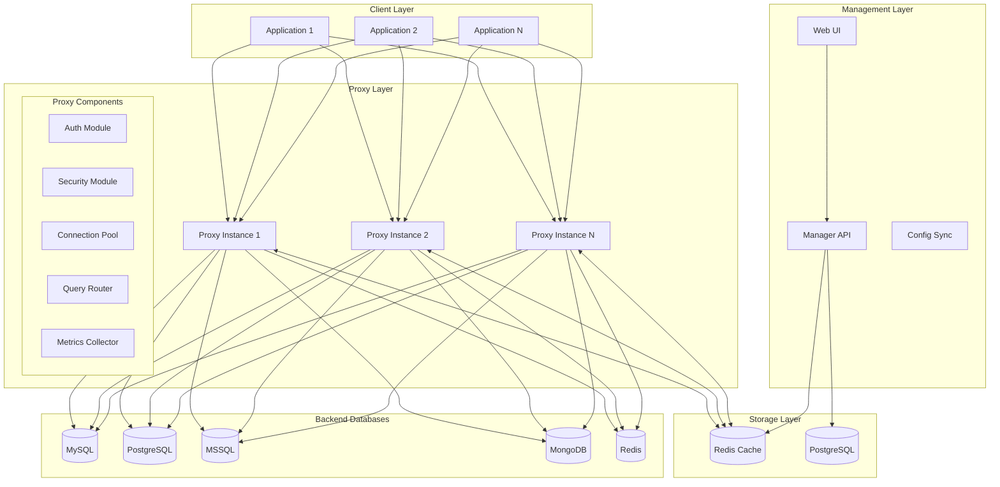
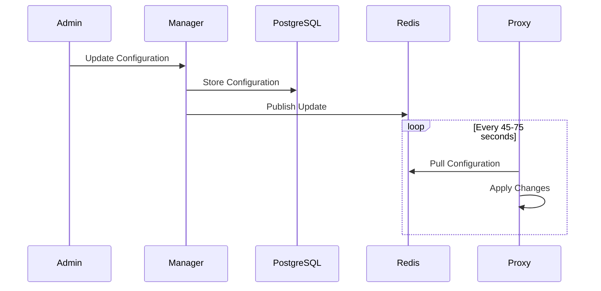
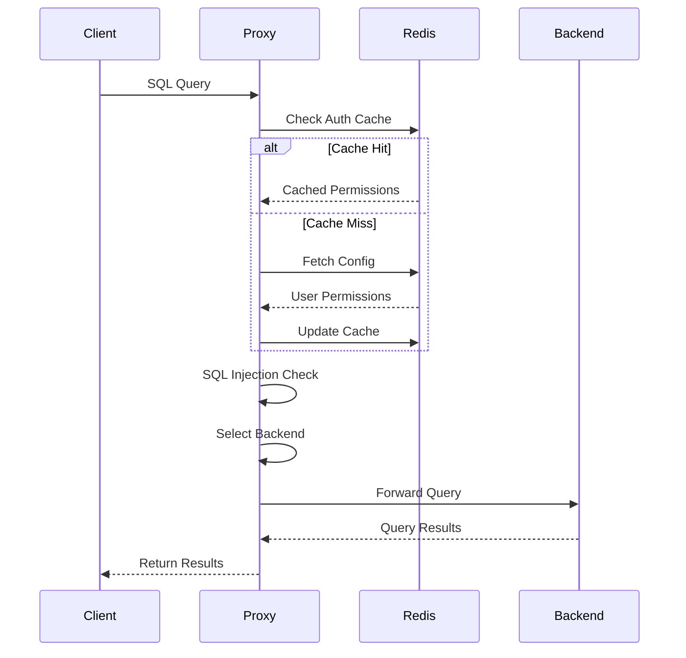

# 🏗️ ArticDBM Architecture

## Overview

ArticDBM follows a microservices architecture with two main components: the Proxy and the Manager. These components work together to provide secure, scalable database access management.

## 🎯 Design Principles

1. **Performance First**: Written in Go for minimal latency
2. **Security by Default**: SQL injection detection, authentication, and authorization
3. **High Availability**: Cluster mode with shared configuration
4. **Cloud Native**: Container-first design with Kubernetes support
5. **Database Agnostic**: Support for multiple database protocols

## 🔧 System Components



## 📦 Component Details

### ArticDBM Proxy

The proxy is the core component handling database traffic.

#### Key Features
- **Protocol Translation**: Native support for multiple database protocols
- **Connection Pooling**: Efficient connection management per backend
- **Query Routing**: Intelligent read/write splitting
- **Security Enforcement**: Real-time SQL injection detection
- **Metrics Collection**: Prometheus-compatible metrics

#### Internal Architecture

```go
type Proxy struct {
    Config        *Config
    AuthManager   *AuthManager
    SecurityCheck *SecurityChecker
    Pools         map[string]*ConnectionPool
    Router        *QueryRouter
    Metrics       *MetricsCollector
}
```

#### Request Flow

1. **Connection Accept**: TCP listener accepts client connection
2. **Protocol Handshake**: Database-specific handshake
3. **Authentication**: Validate user credentials
4. **Authorization**: Check permissions for database/table
5. **Security Check**: SQL injection detection
6. **Query Routing**: Select appropriate backend
7. **Query Execution**: Forward to backend database
8. **Response Processing**: Return results to client

### ArticDBM Manager

The manager provides configuration and monitoring capabilities.

#### Components
- **API Server**: RESTful API for configuration
- **Web UI**: py4web-based management interface
- **Config Sync**: Redis-based configuration distribution
- **Audit Logger**: Query and access logging

#### Data Models

```python
# User Model
class User:
    username: str
    password_hash: str
    enabled: bool
    created_at: datetime
    
# Permission Model
class Permission:
    user_id: str
    database: str
    table: str
    actions: List[str]  # ['read', 'write']
    
# Backend Model
class Backend:
    host: str
    port: int
    type: str  # 'read' or 'write'
    weight: int
    tls_enabled: bool
```

## 🔄 Data Flow

### Configuration Updates



### Query Processing



## 🚀 Performance Optimizations

### Connection Pooling

- Pre-established connections to backends
- Configurable pool size per backend
- Connection health checking
- Automatic reconnection on failure

### Caching Strategy

```yaml
Cache Layers:
  L1 - In-Memory:
    - User permissions (5 min TTL)
    - Backend configurations (1 min TTL)
  L2 - Redis:
    - Full configuration (5 min TTL)
    - Authentication tokens (15 min TTL)
```

### Load Balancing

```go
// Round-robin with weights
func SelectBackend(backends []Backend) *Backend {
    totalWeight := 0
    for _, b := range backends {
        totalWeight += b.Weight
    }
    
    random := rand.Intn(totalWeight)
    for _, b := range backends {
        random -= b.Weight
        if random < 0 {
            return &b
        }
    }
    return &backends[0]
}
```

## 🔒 Security Architecture

### Defense in Depth

1. **Network Level**: TLS encryption for all connections
2. **Authentication**: User credential validation
3. **Authorization**: Fine-grained permission checks
4. **Query Analysis**: SQL injection pattern detection
5. **Audit Logging**: Complete query audit trail

### SQL Injection Detection

```go
patterns := []string{
    `(?i)(\bunion\b.*\bselect\b)`,
    `(?i)(;\s*drop\s+)`,
    `(?i)(\bor\b\s*\d+\s*=\s*\d+)`,
    `(?i)(--|\#|\/\*|\*\/)`,
}
```

## 🌐 Deployment Patterns

### Single Instance

Suitable for development and small deployments:

```yaml
Proxy (Single) → Redis → Backends
Manager → PostgreSQL
```

### High Availability

Production deployment with redundancy:

```yaml
Load Balancer
    ├── Proxy 1 ─┐
    ├── Proxy 2 ─┼─→ Redis Cluster → Backends
    └── Proxy N ─┘
    
Manager (Active/Passive) → PostgreSQL (Primary/Replica)
```

### Multi-Region

Global deployment pattern:

```yaml
Region 1:
  Proxies → Regional Redis → Regional Backends
  
Region 2:
  Proxies → Regional Redis → Regional Backends
  
Global Manager → Global PostgreSQL
Redis Replication: Cross-region sync
```

## 📊 Monitoring & Observability

### Metrics Collection

Key metrics exposed via Prometheus:

- Connection metrics (active, total, failed)
- Query metrics (count, latency, errors)
- Backend health (availability, response time)
- Security events (auth failures, SQL injections)

### Distributed Tracing

Support for OpenTelemetry:

```go
trace.Start(ctx, "query.process",
    trace.WithAttributes(
        attribute.String("db.type", "mysql"),
        attribute.String("db.operation", "SELECT"),
    ))
```

## 🔧 Extension Points

### Custom Security Rules

```python
@security_rule
def custom_check(query: str) -> bool:
    # Custom logic
    return is_safe
```

### Backend Plugins

```go
type BackendPlugin interface {
    Connect(config BackendConfig) error
    Execute(query string) (Result, error)
    Close() error
}
```

## 🎛️ Configuration Management

### Dynamic Configuration

- No restart required for most changes
- Gradual rollout support
- Configuration versioning
- Rollback capability

### Configuration Hierarchy

```yaml
Global:
  - Security settings
  - Default timeouts
  
Per-Database:
  - Backend servers
  - Pool sizes
  - Routing rules
  
Per-User:
  - Permissions
  - Rate limits
  - Audit settings
```

---
*For implementation details, see the [Usage Guide](USAGE.md) or [Kubernetes Deployment](KUBERNETES.md).*