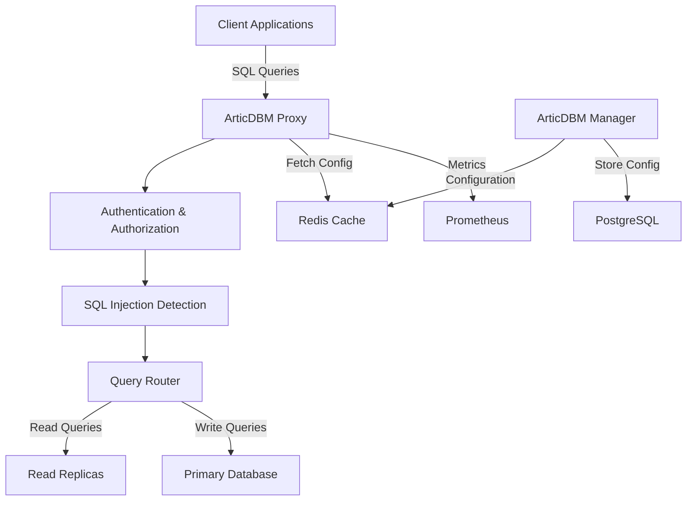

# 📚 ArticDBM Documentation

Welcome to the ArticDBM (Artic Database Manager) documentation! ArticDBM is a high-performance, security-focused database proxy that provides centralized authentication, authorization, and monitoring for multiple database systems.

## 🌟 Key Features

- **Multi-Database Support**: MySQL, PostgreSQL, MSSQL, MongoDB, and Redis
- **Security**: SQL injection detection, user authentication, and fine-grained permissions
- **Performance**: Connection pooling, read/write splitting, and load balancing
- **Monitoring**: Prometheus metrics and comprehensive audit logging
- **Cloud Native**: Docker-based deployment with Kubernetes support
- **High Availability**: Cluster mode with Redis-based configuration sharing

## 📖 Documentation

- [📘 Usage Guide](usage.md) - How to use ArticDBM
- [🏗️ Architecture](architecture.md) - System design and components
- [🚀 Deployment](deployment.md) - Production deployment guide
- [🔒 Security](security.md) - Security features and best practices
- [🔌 API Reference](api.md) - Manager API documentation
- [📝 Release Notes](release-notes.md) - Version history and changes
- [🤝 Contributing](contributing.md) - How to contribute
- [⚖️ License](LICENSE) - AGPL v3 license

## 🚀 Quick Start

```bash
# Clone the repository
git clone https://github.com/articdbm/articdbm.git
cd articdbm

# Start with Docker Compose
docker-compose up -d

# Access the manager UI
open http://localhost:8000

# Connect to proxied MySQL
mysql -h localhost -P 3306 -u testuser -p

# Connect to proxied PostgreSQL  
psql -h localhost -p 5432 -U testuser -d testdb
```

## 🏛️ Architecture Overview



## 🛠️ Components

### ArticDBM Proxy
- Written in Go for maximum performance
- Handles database protocol translation
- Performs security checks and routing
- Maintains connection pools

### ArticDBM Manager
- Built with py4web framework
- Web-based configuration interface
- User and permission management
- Real-time configuration updates

## 📊 Supported Databases

| Database | Version | Protocol Support | Features |
|----------|---------|-----------------|----------|
| MySQL | 5.7+ | Native MySQL | Full support |
| PostgreSQL | 11+ | Native PostgreSQL | Full support |
| MSSQL | 2017+ | TDS Protocol | Full support |
| MongoDB | 4.0+ | MongoDB Wire | Full support |
| Redis | 5.0+ | RESP Protocol | Full support |

## 🔗 Links

- [GitHub Repository](https://github.com/articdbm/articdbm)
- [Docker Hub](https://hub.docker.com/r/articdbm/proxy)
- [Website](https://articdbm.penguintech.io)

## 💡 Getting Help

- Check our [Usage Guide](usage.md) for detailed instructions
- Review [Security Best Practices](security.md)
- Submit issues on [GitHub](https://github.com/articdbm/articdbm/issues)

---
*ArticDBM - Secure, Fast, and Reliable Database Proxy Management*