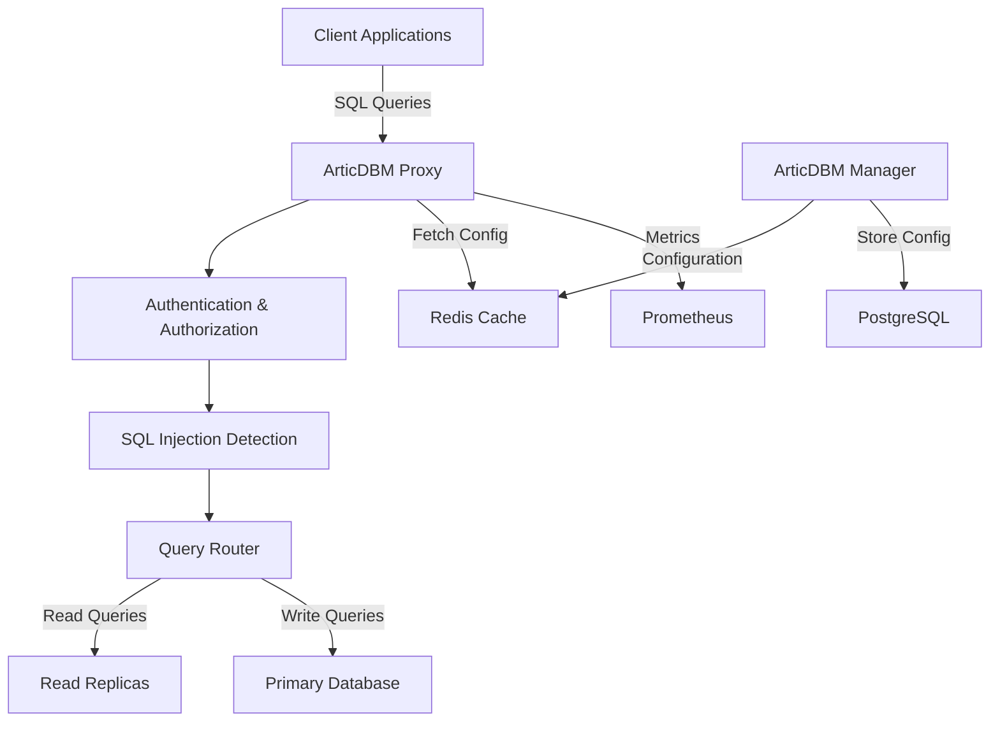

# Welcome to ArticDBM

<div align="center">


[](LICENSE.md)
[](https://hub.docker.com/r/articdbm/proxy)

**High-performance, security-focused database proxy for the modern cloud era**

[Get Started](#quick-start){ .md-button .md-button--primary }
[View on GitHub](https://github.com/articdbm/articdbm){ .md-button }

</div>

---

## What is ArticDBM?

**ArticDBM (Arctic Database Manager)** is a comprehensive database proxy solution that provides centralized authentication, authorization, and monitoring for multiple database systems. Built for performance and security, ArticDBM acts as a secure gateway between your applications and databases.

### 🌟 Key Features

<div class="grid" markdown>

<div class="feature-card" markdown>
### 🗄️ Multi-Database Support
Native support for MySQL, PostgreSQL, MSSQL, MongoDB, and Redis with full protocol compatibility.
</div>

<div class="feature-card" markdown>
### 🔒 Advanced Security
Real-time SQL injection detection, fine-grained permissions, and comprehensive audit logging.
</div>

<div class="feature-card" markdown>
### ⚡ High Performance
Connection pooling, read/write splitting, and intelligent load balancing for optimal performance.
</div>

<div class="feature-card" markdown>
### 📊 Monitoring
Prometheus metrics, real-time dashboards, and detailed performance analytics.
</div>

<div class="feature-card" markdown>
### ☁️ Cloud Native
Docker containers, Kubernetes ready, with support for AWS, GCP, and Azure.
</div>

<div class="feature-card" markdown>
### 🔄 High Availability
Cluster mode with shared configuration, automatic failover, and zero-downtime updates.
</div>

</div>

## Quick Start

Get ArticDBM running in minutes:

```bash
# Clone the repository
git clone https://github.com/articdbm/articdbm.git
cd articdbm

# Start all services
docker-compose up -d

# Access the management interface
open http://localhost:8000

# Connect through the proxy
mysql -h localhost -P 3306 -u your_user -p
```

## Architecture Overview



## Supported Databases

| Database | Version | Protocol | Features |
|----------|---------|----------|----------|
| **MySQL** | 5.7+ | Native MySQL | <span class="badge badge-green">✓ Full Support</span> |
| **PostgreSQL** | 11+ | Native PostgreSQL | <span class="badge badge-green">✓ Full Support</span> |
| **MSSQL** | 2017+ | TDS Protocol | <span class="badge badge-green">✓ Full Support</span> |
| **MongoDB** | 4.0+ | MongoDB Wire | <span class="badge badge-green">✓ Full Support</span> |
| **Redis** | 5.0+ | RESP Protocol | <span class="badge badge-green">✓ Full Support</span> |

## Why Choose ArticDBM?

### Security First
- **14+ SQL Injection Patterns** detected in real-time
- **Fine-grained Permissions** at database and table level
- **Complete Audit Trail** for compliance and monitoring
- **TLS Encryption** for all connections

### Performance Optimized
- **< 1ms Added Latency** per query
- **100K+ Queries/Second** per proxy instance
- **Connection Pooling** reduces backend load by 10-50x
- **Smart Read/Write Splitting** automatically routes queries

### Production Ready
- **Zero-Downtime Updates** with dynamic configuration
- **Multi-Region Support** for global deployments
- **Prometheus Metrics** for comprehensive monitoring
- **Docker & Kubernetes** ready for any environment

## What's Next?

<div class="grid" markdown>

<div markdown>
### 📘 [Usage Guide](usage.md)
Complete installation and configuration guide with examples.
</div>

<div markdown>
### 🏗️ [Architecture](architecture.md)
Deep dive into system design and component interactions.
</div>

<div markdown>
### 🚀 [Deployment](deployment.md)
Production deployment patterns for Docker and Kubernetes.
</div>

<div markdown>
### 🔒 [Security](security.md)
Security features, best practices, and compliance guidance.
</div>

<div markdown>
### 🔌 [API Reference](api.md)
Complete API documentation for the management interface.
</div>

<div markdown>
### 🤝 [Contributing](contributing.md)
How to contribute to ArticDBM development.
</div>

</div>

---

<div align="center">

**ArticDBM - Keep Your Databases Cool Under Pressure** ❄️

*Made with ❤️ for the developer community*

</div>